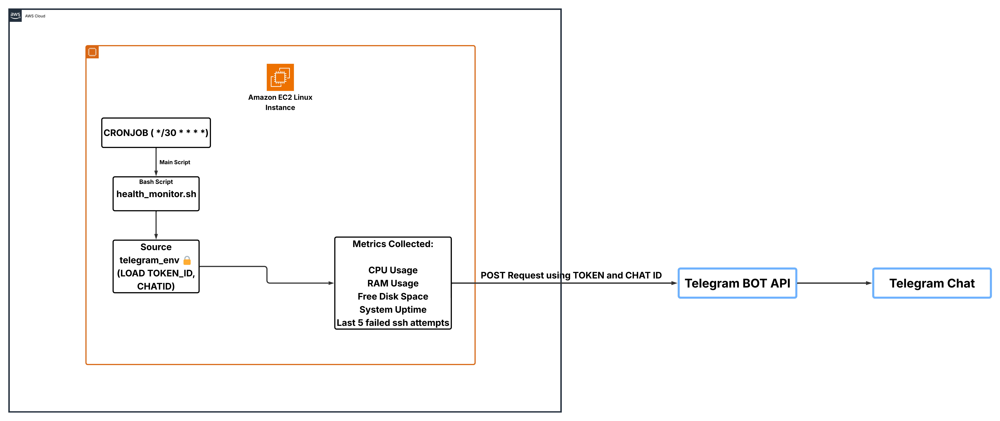
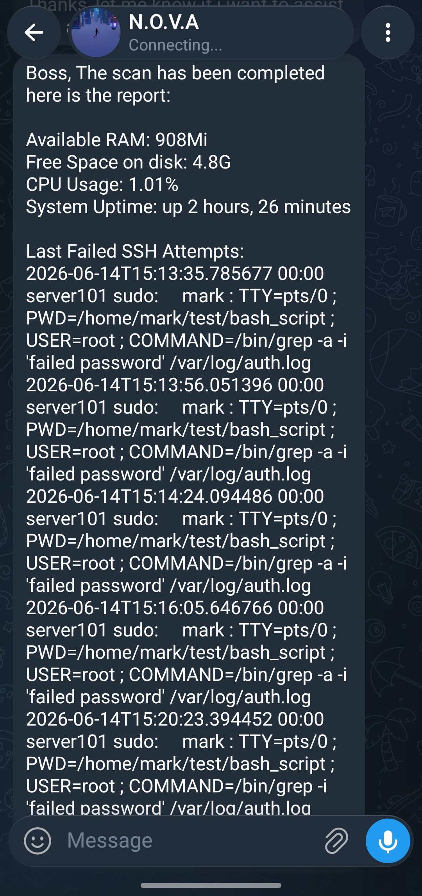

# Linux System Health Monitor with Telegram Alerts
## Overview
This project automates server health monitoring using a simple Bash script. Instead of manually checking your server status, the script collects key metrics and sends them directly to your Telegram account via cron job automation. Perfect for DevOps engineers, system administrators, and anyone who needs to keep tabs on their Linux servers.

## Architecture Diagram


## Key Features:
 - Real-time CPU, RAM, and disk space monitoring
 - Tracks system uptime and failed SSH login attempts
 - Automated execution every 30 minutes via cron jobs
 - Secure token management using separate configuration file 
 - Lightweight implementation with minimal server overhead
 - Direct Telegram notifications to your phone or desktop

## How It All Works Together
The monitoring solution works in three main Steps:
### Step 1: Scheduling
- The cron job triggers automatically every 30 minutes using the schedule
 ```
  */30 * * * *  /file/path/of/script
```
No manual intervention needed - it runs completely in the background.

### Step 2: Data Collection
 - When the script runs, it collects five critical server metrics:
 1. CPU usage percentage using mpstat
 2. Available RAM in human-readable format
 3. Free disk space on the root partition
 4. System uptime in a friendly format
 5. Last 5 failed SSH login attempts from auth.log


### Step 3: Notification
The script sources your Telegram credentials from a secure configuration file, builds a formatted message with all collected metrics, and sends it via Telegram's BOT API. You receive the report instantly on your Telegram app.

The architecture ensures credentials remain secure, the script runs automatically without passwords, and you get consistent monitoring coverage around the clock.


## Prerequisites
### System Requirements:

Linux server running Ubuntu or Debian-based distribution
Bash shell (version 4.0 or higher)
Root or sudo access (for reading auth.log and grep)
Basic commands: free, df, uptime, grep, mpstat, curl

### Telegram Setup:

Telegram account (create one at telegram.org if you don't have it)
Telegram BOT token (create a bot via @BotFather on Telegram)
Your Telegram Chat ID (message @userinfobot to get your ID)


### File Permissions:

Write access to /home/your_username/ directory
Read access to /var/log/auth.log
Execute permissions for the script

## Get it running 
    
Step 1: Clone the repo
```bash
  git clone https://github.com/deepakraj-dj/linux-health-monitor
```

Step 2: Add your Telegram credentials in telegram_env:
```bash
TBOT_TOKEN="your_telegram_bot_token_here"
TCHATID="your_telegram_chat_id_here"
```
Save with Ctrl + X, then Y, then Enter.

Step 3: Set Secure Permissions

Restrict access to your token file:

```bash
chmod 600 telegram_env
```
This ensures only you can read the file.

Step 4: Access the script named as health_monitor.sh and check it by running manually
```bash
./health_monitor
```
Step 5: Configure Sudo Without Password

Allow the script to read auth.log without password prompts:

```bash
sudo visudo
```
Add this line at the END of the file:
```bash
your_username ALL=(ALL) NOPASSWD: /bin/grep

Replace your_username with your actual username. Example:

bashmark ALL=(ALL) NOPASSWD: /bin/grep
```
⚠️ This command gives sudo access to grep command meaning grep does not ask password when it is used after this configuration. Just for an Awareness.

Save with Ctrl + X, then Y, then Enter.

Step 6: Schedule with Cron Job

Open crontab editor:

```bash
crontab -e
```
Add this line to run every 30 minutes:

```bash
*/30 * * * * /home/mark/test/bash_script/health_monitor.sh >> /var/log/server-monitor.log 2>&1
```
Save with Ctrl + X, then Y, then Enter.

Step 7: Verify Cron Job Installation

```bash
crontab -l
```
You should see your monitoring script listed.

Step 8: Test

Run the script manually to verify everything works:

```bash
/home/mark/test/bash_script/health_monitor.sh
```
You should see:

Metrics printed to console
"✅ Report sent successfully!" message
Report appears in your Telegram chat within seconds

if you faced an issue 
Check the log file:

```bash
tail -f /var/log/server-monitor.log
```

## Sample Telegram Output
<div align="center">
  
</div>


 ## What I Learned
 
- Bash Automation: Built cron-scheduled monitoring scripts that eliminate manual server health checks
- System Metrics Collection: Extracted real-time CPU, RAM, disk data from Linux kernel using standard tools
- Secure Credential Management: Separated API tokens from code using environment files with restricted permissions
- External API Integration: Connected Telegram Bot API for real-time alerts and learned request-response handling
- Linux Permissions & Automation: Configured sudoers access and cron scheduling for unattended operation
- Error Handling & Reliability: Implemented validation for dependencies and API failures—learned why silent failures are dangerous


# File Structure
```
.
├── docs/                      
│   └── architecture_diagram.png           #architecture diagram of full flow
│       
├── .gitignore                             # configure the env file in this file to ignore while pulling
├── LICENSE
├── README.md
├── health_monitor.sh                     # bash script for monitoring and to send metrics to telegram
├── telegram_env.example
```
